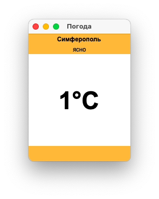

МИНИСТЕРСТВО НАУКИ  И ВЫСШЕГО ОБРАЗОВАНИЯ РОССИЙСКОЙ ФЕДЕРАЦИИ 
Федеральное государственное автономное образовательное учреждение высшего образования 
"КРЫМСКИЙ ФЕДЕРАЛЬНЫЙ УНИВЕРСИТЕТ им. В. И. ВЕРНАДСКОГО" 
ФИЗИКО-ТЕХНИЧЕСКИЙ ИНСТИТУТ 
Кафедра компьютерной инженерии и моделирования

 
<h3 align="center">Отчёт по лабораторной работе № 1  по дисциплине "Программирование"</h3>
  

студента 1 курса группы ПИ-б-о-201(2) 
Милицин Владислав Георгиевич 
направления подготовки 09.03.04 "Программная инженерия"

  
<table>
<tr><td>Научный руководитель  старший преподаватель кафедры  компьютерной инженерии и моделирования</td>
<td>(оценка)</td>
<td>Чабанов В.В.</td>
</tr>
</table>
  

Симферополь, 2020

## Цель работы

- Получить опыт работы с json
- Научится работать с многофайловым проектом
- Получить знания в Web-структуре проектов

## Ход работы

##### Начало работы

1. Для начала зарегестрируемся на сайте openweathermap.org и получим API-key

<h4>Мой API-key</h4> 
eff249724eb9589a6c6a62e8dfb5578f

2. Далее необходимо создать запрос на получение определенного, заданного структурированного прогноза погоды в json

<h4>Запрос</h4> 
http://api.openweathermap.org/data/2.5/onecall?id=524901&appid=eff249724eb9589a6c6a62e8dfb5578f&lang=ru&units=metric&lat=44.95719&lon=34.11079&exclude=current,minutely,daily,alerts

3. Через сайт worldtimeapi.org получаем время города Симферополя

<h4>Запрос времени</h4> 
http://worldtimeapi.org/api/timezone/Europe/Simferopol

4. В результате создадим сервер для получения данных путем прослушки порта 3000, При обработке запросов получим json данных обработанны через openweathermap.org, получившие данные попадают в кэш по истечению периода времение кэш обновляется.

<h4>Код</h4> 
[[C++]](https://github.com/tw9ntyseven/Programming/blob/master/Labs/01/%D0%A1%2B%2B/Server/server/server/main.cpp)

5. Далее необходимо создать клиентскую часть приложения на языке Python с использованием Tkinker, и запросами через requests.

<h4>Код</h4> 
[[Python]](https://github.com/tw9ntyseven/Programming/blob/master/Labs/01/Python/my.py)

6. Фото виджета и python приложения представлены на рисунке 1, 2.

*рис. 1 Виджет на HTML*

Скриншот клиента:

*рис. 2 клиентское приложение на Python*

## Выводы

В результате работы я научился работать со структурой в многофайловом проекте, были изучены основные аспекты в работе с json, также были определены и закреплены навыки работы в web интерфейсах.